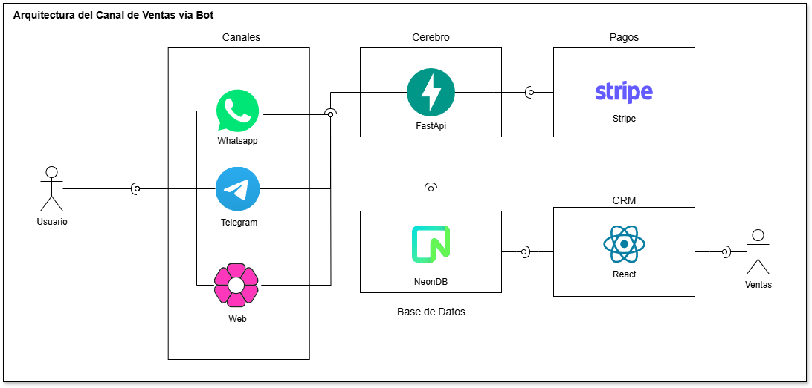

# Camaral AI - Sales & Support Chatbot

**Modernizando la interacción con potenciales clientes mediante Humanos Digitales e IA Generativa.**

Este proyecto implementa el "cerebro" conversacional para **Camaral AI**, diseñado para automatizar el ciclo de ventas, desde la captación de leads hasta el cierre del pago, ofreciendo una experiencia 24/7 rápida y empática.



## 📋 Descripción

El sistema actúa como un SDR (Sales Development Representative) inteligente capaz de:

- **Educar**: Responder consultas técnicas sobre avatares, integraciones y casos de uso.
- **Captar**: Calificar leads y registrarlos automáticamente en el CRM.
- **Vender**: Consultar el catálogo de planes y generar enlaces de pago seguros (Stripe).
- **Analizar**: Mantener contexto y memoria de la conversación (Window Context).

Powered by **Google Gemini 2.0 Flash** para una latencia mínima y capacidades robustas de _Tool Calling_.

## 🚀 Stack Tecnológico

- **Core Backend**: Python 3.13+, FastAPI.
- **IA & LLM**: Google Gemini 2.0 Flash (via `google-genai` SDK v1.0+).
- **Persistencia**: SQLAlchemy (ORM) + SQLite (Dev) / Postgres (Prod).
- **Pagos**: Stripe Checkout API.
- **Frontend de Prueba**: Vanilla JS + CSS3 (Diseño moderno tipo Dashboard).

## 🛠️ Estructura del Proyecto

El proyecto sigue principios de **Clean Architecture** para garantizar mantenibilidad:

```
camaral-ai/
├── app/
│   ├── adapters/     # Interfaces externas (Web API, DB connection)
│   ├── core/         # Configuración del sistema (Env vars)
│   ├── domain/       # Entidades de negocio (Customer, Product, Order)
│   ├── services/     # Lógica de negocio pura (Gemini, Stripe, Tools)
│   ├── main.py       # Entrypoint de la aplicación
│   └── INSTRUCTIONS.md # Prompt del sistema y Knowledge Base
├── test/
│   └── web/          # Cliente web de prueba (Responsive)
└── README.md
```

## ⚙️ Configuración e Instalación

### Prerrequisitos

- Python 3.10 o superior.
- API Key de Google AI Studio (Gemini).
- API Secret Key de Stripe (Modo Test).

### Pasos

1.  **Clonar el repositorio**

    ```bash
    git clone <url-del-repo>
    cd camaral-ai
    ```

2.  **Instalar dependencias**

    ```bash
    pip install fastapi uvicorn google-genai stripe sqlalchemy pydantic-settings
    ```

3.  **Configurar Variables de Entorno**
    Crea un archivo `.env` en la raíz copiando el ejemplo:
    ```bash
    cp .env.example .env
    ```
    Edita `.env` con tus credenciales:
    ```ini
    GEMINI_API_KEY=AIzaSy...
    STRIPE_API_KEY=sk_test_...
    DATABASE_URL=sqlite:///./camaral.db
    ```

## ▶️ Ejecución

1.  **Iniciar el Backend**

    ```bash
    python app/main.py
    ```

    El servidor iniciará en `http://0.0.0.0:8000` con _auto-reload_ habilitado.

2.  **Probar el Cliente Web**
    Abre el archivo `test/web/index.html` directamente en tu navegador.
    - Interactúa con el bot.
    - Los enlaces de pago de Stripe se convertirán automáticamente en botones "Pagar Ahora".

## 🤖 Capacidades del Agente (Tools)

El bot tiene acceso a herramientas reales para ejecutar acciones de negocio:

1.  **`create_lead(name, email, phone)`**
    - Registra un nuevo cliente en la BD `customers`.
    - Si el email ya existe, actualiza la información de contacto.

2.  **`search_products(query)`**
    - Busca en la tabla `products` para dar información precisa de precios y planes.

3.  **`create_payment(email, amount)`**
    - Verifica que el cliente exista.
    - Genera una **Stripe Checkout Session**.
    - Registra la `Order` en estado `pending`.
    - Devuelve una URL segura para completar la transacción.

## 📄 Licencia

Propiedad de Todos. Uso restringido para desarrollo interno y pruebas (y para Makers).
